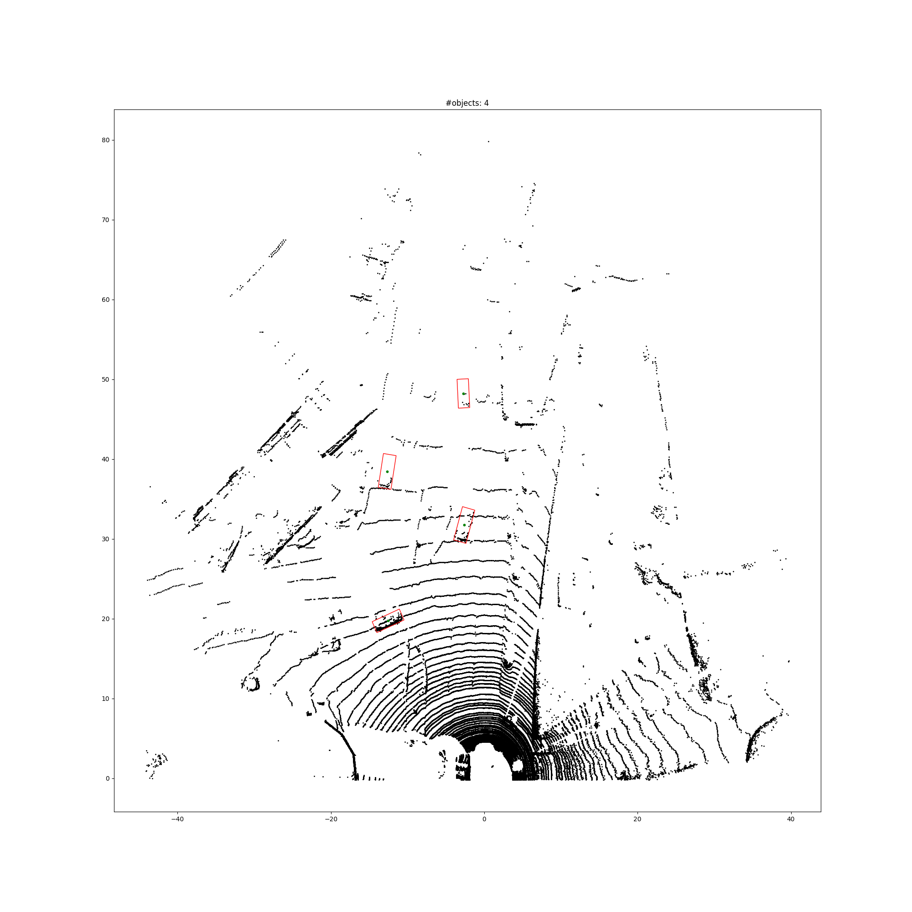

# My PIXOR

This is an unofficial PIXOR implementation. [PIXOR](https://arxiv.org/abs/1902.06326) is a neural network for object detection in LiDAR data. It works by discretizing the point-cloud onto an image (2D topview) and then applying a one-stage object detection based on YOLO (but simpler, without anchors). The innovation over YOLO is that it also outputs angles.

## Usage

* `train.py FILENAME` to train the model (saves to the given filename)
* `eval.py FILENAME` to evaluate the model (loads from a given filename)

The two most important parts of the implementation are: (1) the input transformation (`mydata.py`), and (2) the model itself (`mymodels.py`). I have used KITTI (like the paper), but it should be fairly easy to extend to other datasets (just add a dataset class similar to `KITTI`).

## TO DO

Some things are unclear from the paper. I comment what these are in the code. When unclear, I went with my best guess based on the cited papers said, including the subsequent paper [HDNET](http://proceedings.mlr.press/v87/yang18b/yang18b.pdf) from the same authors. I did not quite understand the exact number of neurons to use from the paper architecture diagram; when undecided, I went with the smallest choice. Let me know if you make any improvements.

**Lacking:** (1) we do not yet implement NMS since the IoU is a little tricky because of the angular bounding boxes, (2) no metrics are implemented for the same reason, but KITTI website has evaluation code you can use.

-- Ricardo Cruz <rpcruz@fe.up.pt>
