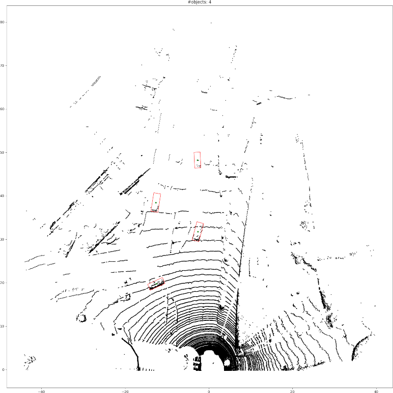

# My PIXOR

This is an unofficial PIXOR implementation. [PIXOR](https://arxiv.org/abs/1902.06326) is a neural network for object detection in LiDAR data. It works by discretizing the point-cloud onto an image (2D topview) and then applying a one-stage object detection based on YOLO (but simpler, without anchors). The innovation over YOLO is that it also outputs angles. This implementation used my [objdetect package](https://github.com/rpmcruz/objdetect).

For the time being, this implementation is merely educational. It has not been thoroughly tested. Two things that are interesting to study: (1) how to discretize a point-cloud in top-view (only KITTI for now!), (2) have an idea of how the PIXOR model works.

*To improve:* (1) the fact that PIXOR uses angular bounding-boxes means that NMS and metrics must be optimized for that, but not sure if the PIXOR authors take it in consideration since the effect will be small, (2) the model/losses/etc require a little love to make this authentic; simple things related to the architecture, the fact that I am using CE instead of Focal Loss w/ smoothness, and possibly other small details.

-- Ricardo Cruz
